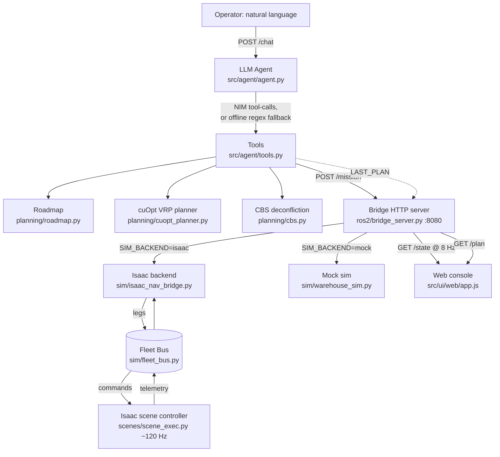
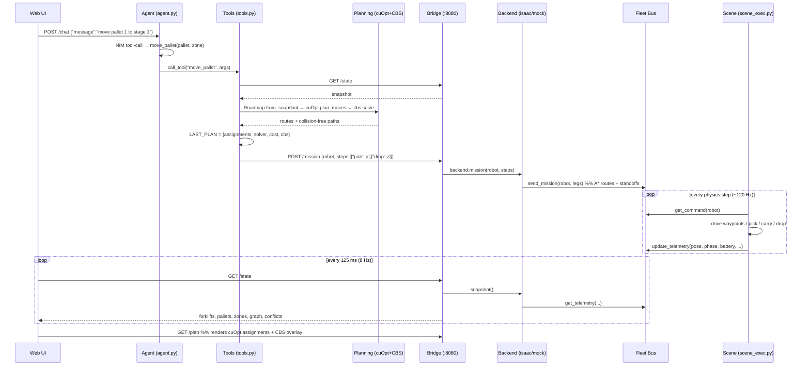
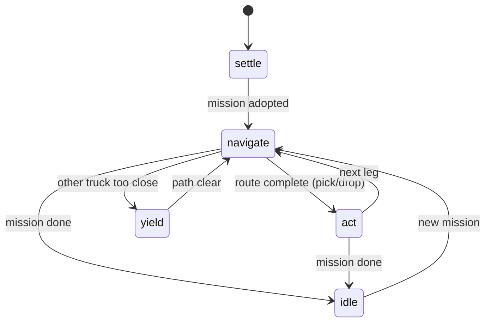
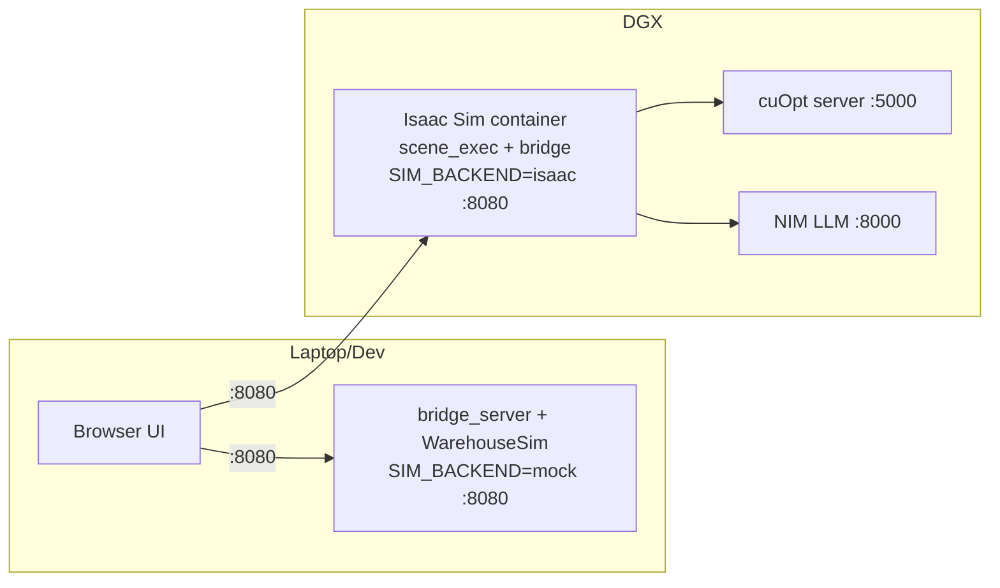

# FleetMind — Architecture

FleetMind is an AI-driven warehouse fleet orchestrator. Operators command a fleet of
autonomous forklifts in plain English; behind the scenes an LLM agent turns that intent
into an optimised, collision-free plan (NVIDIA cuOpt + Conflict-Based Search) and dispatches
it to forklifts running either inside an NVIDIA Isaac Sim digital twin or a lightweight
offline mock. A live web console streams the whole thing back at 8 Hz.

This document explains how the system is structured and how data flows end to end.

---

## 1. Overview



Three ideas make the whole system easy to reason about:

1. **One planning stack.** Planning happens in the agent's tools layer
   (`src/agent/planning/*`). The bridge and backends only *execute* pre-planned missions —
   they never plan.
2. **The Fleet Bus is the seam.** An in-process, thread-safe singleton decouples the
   HTTP/planning world (commands) from the physics/scene world (telemetry).
3. **The backend is swappable.** `SIM_BACKEND=mock` (laptop, kinematic, 30 Hz) and
   `SIM_BACKEND=isaac` (DGX, PhysX, ~120 Hz) expose an *identical* interface, so everything
   above the bus is unchanged between them.

---

## 2. System Architecture

FleetMind is a layered pipeline. Each layer has one job and talks only to its neighbours:

**Operator → Agent → Planning → Bridge → Bus → Scene → State → UI**

### Component responsibilities

| Layer | File(s) | Responsibility |
|---|---|---|
| Operator UI | `src/ui/web/{index.html,app.js,styles.css}` | Render the warehouse, forklifts, pallets, battery, graph overlay; send chat commands; poll `/state` at 8 Hz |
| LLM Agent | `src/agent/agent.py`, `nim_client.py`, `offline_intent.py` | Turn natural language into tool calls (NIM tool-calling, or an offline regex fallback) |
| Tools / Orchestration | `src/agent/tools.py`, `world_state.py` | Execute tools: snapshot → plan → deconflict → dispatch; publish `LAST_PLAN` |
| Planning | `src/agent/planning/{roadmap,cuopt_planner,cbs,conflict}.py` | Build the nav graph, solve the VRP (cuOpt), deconflict paths (CBS), detect live near-misses |
| Bridge server | `src/ros2/bridge_server.py`, `bridge_client.py` | FastAPI REST API on port 8080; selects the backend; serves `/state` and `/plan` |
| Backend (sim) | `src/sim/isaac_nav_bridge.py` **or** `src/sim/warehouse_sim.py` | Convert missions into A* routes + standoff legs; step the world; produce snapshots |
| Fleet Bus | `src/sim/fleet_bus.py` | Thread-safe command/telemetry channel shared in-process |
| Scene controller | `scenes/scene_exec.py` | Isaac physics-step state machine: drive forklifts, pick/drop, publish telemetry |
| Launch | `scenes/run_scene.sh`, `scripts/deploy_cuopt.sh` | Start Isaac in Docker; deploy the self-hosted cuOpt server |

### The swappable backend

The bridge picks a backend at startup from the `SIM_BACKEND` environment variable:

```python
# src/ros2/bridge_server.py
BACKEND = os.getenv("SIM_BACKEND", "mock").lower()   # "mock" | "isaac"
if BACKEND == "isaac":
    _sim = IsaacNavBackend()          # in-process adapter over the Isaac scene
else:
    _sim = WarehouseSim(); _sim.start()   # own 30 Hz kinematic stepping thread
```

Both backends implement the same methods (`snapshot()`, `go_to()`, `pick()`, `drop()`,
`go_home()`, `mission()`, `block_zone()`), so the agent, planning, API and UI are identical
regardless of which is running.

---

## 3. Data Flow

### Vocabulary (four terms people conflate)

| Term | Meaning |
|---|---|
| **Mission** | The operator's high-level intent (e.g. "move pallet 1 to stage 1") |
| **Plan** | cuOpt + CBS output: which forklift does what, in what order, on which collision-free paths |
| **Command** | The serialised plan for *one* forklift — an ordered list of Legs (lives on the bus) |
| **Leg** | A single step: navigate along waypoints, then optionally `pick`/`drop` |

Flow: **Mission → Plan → Command (legs) → Leg execution in the scene.**

### End-to-end: "Move pallet 1 to stage 1"



### The reverse path (telemetry out)

The scene controller is the **source of truth** for pose, phase and battery. Every physics
step it writes telemetry to the bus. The backend's `snapshot()` reads the bus, the bridge
adds `conflicts = live_conflicts(snap)`, and the UI polls `/state` at 8 Hz and smooths the
motion to 60 fps for rendering.

---

## 4. Component Reference

### 4.1 LLM Agent (`src/agent/`)

- **`agent.py`** — `run(user_message)` is the main loop. It checks `_nim_available()`; if the
  NIM (local Llama via `nim_client.py`) is reachable it does ReAct-style **tool calling**,
  otherwise it falls back to `run_offline()`.
- **`offline_intent.py`** — a dependency-free regex intent parser. Maps phrases to tool
  calls (e.g. `pallet && zone → move_pallet`, `"optimize" → optimize_and_dispatch`,
  `"spill"/"fire"/"block" → block_zone`). This is what keeps demos working when the DGX/NIM
  is offline.
- **`tools.py`** — the executable tools and their OpenAI-compatible schemas
  (`get_fleet_status`, `move_pallet`, `pick_pallet`, `drop_pallet`, `send_home`,
  `optimize_and_dispatch`, `plan_routes`, `block_zone`, `detect_conflict`). The core helper
  `_plan_and_dispatch()` runs the full snapshot → plan → deconflict → dispatch pipeline and
  stores the result in the module-global `LAST_PLAN` (served via `/plan`).

### 4.2 Planning (`src/agent/planning/`)

- **`roadmap.py`** — `Roadmap.from_snapshot()` builds the waypoint graph. If the snapshot
  already carries a `graph` (the mock does), it adopts it; otherwise it synthesises a uniform
  grid over the floor bounding box and punches out cells near pallets/zones. Provides
  `astar()` / `astar_straight()` and `nearest(x, y)`.
- **`cuopt_planner.py`** — `plan_moves()` solves a capacitated pickup-and-delivery VRP:
  which forklift takes which pallet to which zone, and in what order. It calls a self-hosted
  **NVIDIA cuOpt** REST server (async `/cuopt/request` → poll `/cuopt/solution/{id}`) when
  `CUOPT_URL` is set, and falls back to a local greedy cheapest-insertion + per-vehicle 2-opt
  solver otherwise. Battery-aware: forklifts below the low-battery threshold are excluded when
  charged trucks are available. Returns a `Plan(routes, total_cost, solver)`.
- **`cbs.py`** — Conflict-Based Search for multi-agent deconfliction. High level searches a
  constraint tree; low level is space-time A*. Guarantees no two trucks occupy the same node
  at the same time tick and no edge swaps. Idle forklifts are pinned as stationary obstacles
  so moving trucks route around them. Returns `Result(resolved, conflicts_found, paths)`.
- **`conflict.py`** — `live_conflicts(snap)` scans the current snapshot for closing forklift
  pairs within a warning distance (feeds the UI hazard overlay); `route_conflicts(paths)`
  validates CBS output.

### 4.3 Bridge server (`src/ros2/bridge_server.py`)

FastAPI app on **port 8080**. Selects the backend, serves the REST API, and augments
`/state` with live conflicts. See the [API Reference](#6-api-reference) for shapes.

### 4.4 Fleet Bus (`src/sim/fleet_bus.py`)

The in-process contract between planning/HTTP and the scene. Thread-safe singleton accessed
via `bus()`. Core dataclasses:

```python
@dataclass
class Leg:           # one step of a command
    action: str      # "goto" | "pick" | "drop" | "home"
    target: str      # pallet / zone / node id
    waypoints: list[tuple[float, float]]
    pallet_path: str
    drop_xy: tuple[float, float] | None

@dataclass
class Command:       # a forklift's current mission
    seq: int
    legs: list[Leg]

@dataclass
class Telemetry:     # a forklift's live state
    x: float; y: float; yaw: float
    phase: str       # idle|navigating|picking|lifting|carrying|dropping|returning
    carrying: str | None
    lift_height: float; speed: float; battery: float
    route: list[str]; target: str | None
    object_detected: str; object_distance: float; path_blocked: bool
```

Bridge → bus: `send_mission()`, `set_pallet()`, `set_zone()`. Scene → bus:
`update_telemetry()`, `clear_command()`. Both sides read with `get_command()` /
`get_telemetry()`.

### 4.5 Scene controller (`scenes/scene_exec.py`)

Loads the Isaac warehouse, spawns forklifts/pallets/zones, and subscribes to the PhysX
physics-step event. Each step, `_on_step()` runs a state machine per forklift:



- **Kinematic driving** — base pose (XY + yaw) is set directly along densified waypoints;
  yaw slews at a max turn rate.
- **Reactive collision avoidance** — a *step-time* layer (independent of CBS): a give-way
  truck brakes for a moving higher-priority truck, or side-steps around a stationary blocker.
- **Kinematic pallet carry** — a carried pallet is kinematic (follows the forks) to avoid
  PhysX contact storms, then flips to dynamic on drop so it settles naturally.
- **Battery** — drains with distance driven and recharges while parked near a charger; the
  scene is the source of truth and publishes `battery` in telemetry every step.

### 4.6 Mock sim (`src/sim/warehouse_sim.py`)

A physics-free, thread-safe kinematic twin used when `SIM_BACKEND != "isaac"`. Runs its own
30 Hz stepping thread, drives A* routes, animates timed pick/drop, and exposes the *same*
snapshot shape and methods as the Isaac backend — so the rest of the stack can't tell the
difference.

### 4.7 Web UI (`src/ui/web/`)

`app.js` polls `/state` every 125 ms (8 Hz), exponentially smooths poses toward the latest
snapshot, and renders a 2D top-down canvas at ~60 fps: waypoint graph, forklifts (colour by
phase), pallets, zones (green/red), route overlays, battery bars, charger markers, and a
hazard vignette on incidents. It also polls `/plan` to overlay cuOpt assignments and CBS
paths, and posts operator text to `/chat`.

---

## 5. Key Subsystems

### 5.1 Battery & charging

- **Source of truth:** the running backend (scene controller for Isaac, `warehouse_sim` for
  mock). Battery drains proportional to distance driven and recharges while parked near a
  charger dock.
- **Exposed in `/state`** as `forklifts[name].battery` (0–100 %).
- **Consumed by planning:** `cuopt_planner` reads the battery percentage to bound a truck's
  usable range and to prefer fuller trucks; trucks under the low-battery threshold are held
  back for charging when alternatives exist.

### 5.2 Collision avoidance (two independent layers)

1. **Planning-time (CBS)** — `cbs.solve()` produces time-parameterised, collision-free node
   sequences before dispatch. Idle trucks are pinned as obstacles.
2. **Step-time (reactive)** — inside `scene_exec.py`, forklifts watch each other every
   physics step and brake or side-step as conflicts develop mid-route (because both trucks
   move after the static plan was made).

### 5.3 Moving to a new warehouse

The layout is defined by a small set of constants (`FORKLIFTS`, `PALLETS`, `ZONES`,
`CHARGERS`) mirrored in `scenes/scene_exec.py` and `src/sim/isaac_nav_bridge.py`; bounds, the
nav-grid and the UI scale are all derived automatically from these. A same-size facility is a
constants edit; a genuinely different building additionally requires swapping the warehouse
USD model and reframing the camera in `scene_exec.py`. Keep the two copies of the layout
constants in sync (a candidate for future refactor into one shared config module).

---

## 6. API Reference

Base URL: `http://localhost:8080` (FastAPI, `src/ros2/bridge_server.py`).

| Method | Path | Request body | Purpose |
|---|---|---|---|
| GET | `/health` | — | `{ok, backend}` — detect mock vs isaac |
| GET | `/state` | — | Full world snapshot (see below) |
| GET | `/plan` | — | Latest cuOpt + CBS plan (`LAST_PLAN`) |
| POST | `/goto` | `{robot, node}` | Send a forklift to a node |
| POST | `/pick` | `{robot, pallet}` | Pick a pallet |
| POST | `/drop` | `{robot, zone}` | Drop at a zone |
| POST | `/home` | `{robot}` | Return to charger/home |
| POST | `/mission` | `{robot, steps:[["pick",id],["drop",id]]}` | Multi-step mission |
| POST | `/block_zone` | `{zone, kind}` | Flag an incident; auto-reroute |
| POST | `/chat` | `{message}` | Natural-language command to the agent |
| POST | `/reset` | `{}` | Reset the scene to spawn state |

### `/state` response shape

```jsonc
{
  "t": 12.34,
  "forklifts": {
    "AMR_1": {
      "x": 1.5, "y": 2.0, "yaw": 0.3,
      "phase": "navigating",            // idle|navigating|picking|lifting|carrying|dropping|returning
      "carrying": null,                  // or a pallet id
      "lift_height": 0.0, "speed": 0.8,
      "battery": 87.3,                   // 0–100 %
      "route": ["n5", "n7", "n9"],
      "target": "WH_Palette_01",
      "object_detected": "None", "object_distance": 0.0, "path_blocked": false
    }
  },
  "pallets": { "WH_Palette_01": { "x": 1.5, "y": 2.0, "carried_by": "AMR_1", "delivered": false } },
  "zones":   { "stage_1": { "x": -6.0, "y": 7.0, "blocked": false } },
  "graph":   { "nodes": { "n0": [x, y] }, "edges": [["n0", "n1"]] },
  "conflicts": [ { "a": "AMR_1", "b": "AMR_2", "distance": 1.9, "severity": "high" } ]
}
```

### `/plan` response shape

```jsonc
{
  "solver": "cuopt",                     // "cuopt" | "local" | "none"
  "total_cost": 42.5,
  "assignments": { "AMR_1": ["WH_Palette_01→stage_1"] },
  "recharging": [],
  "battery": { "AMR_1": 87, "AMR_2": 100 },
  "cbs": { "conflicts_found": 1, "resolved": true, "paths": { "AMR_1": ["n5","n7","n9"] } }
}
```

---

## 7. Configuration & Deployment

### Environment variables

| Variable | Default | Used by | Purpose |
|---|---|---|---|
| `SIM_BACKEND` | `mock` | bridge_server | `mock` (kinematic) or `isaac` (PhysX) backend |
| `CUOPT_URL` | *(unset)* | cuopt_planner | Self-hosted cuOpt REST server; enables NVIDIA solver |
| `NIM_BASE_URL` | `http://0.0.0.0:8000/v1` | nim_client | Local NIM LLM endpoint |
| `NIM_MODEL` | `meta/llama-3.1-70b-instruct` | nim_client | Model name for tool calling |
| `BRIDGE_URL` | `http://localhost:8080` | bridge_client | Where tools/agent reach the bridge |
| `PUBLIC_IP` | Tailscale IP | run_scene.sh | Isaac WebRTC streaming host |

### Process topology



### Running modes

**Laptop (offline mock):**
```bash
python -m uvicorn src.ros2.bridge_server:app --host 0.0.0.0 --port 8080
# open src/ui/web/index.html against http://localhost:8080
```

**DGX (Isaac digital twin):**
```bash
bash scripts/deploy_cuopt.sh                    # start the self-hosted cuOpt server (:5000)
PUBLIC_IP=<ip> CUOPT_URL=http://localhost:5000 ./scenes/run_scene.sh
# scene_exec.py loads the scene and starts the bridge in-process (SIM_BACKEND=isaac)
```

**Agent (CLI):**
```bash
python -m src.agent.agent "move pallet 1 to stage 1"
```

---

## 8. Notes & conventions

- **All coordinates are in metres**; the Isaac sample warehouse ships in cm and is auto-scaled.
- **Layout constants are duplicated** in `scene_exec.py` and `isaac_nav_bridge.py` and must be
  kept in sync.
- **Planning lives in the agent**, not the bridge — the bridge/backends only execute missions.
- **The Fleet Bus is in-process**; the Isaac bridge runs in the same Kit process as the scene
  controller so they share the same `bus()` singleton.
